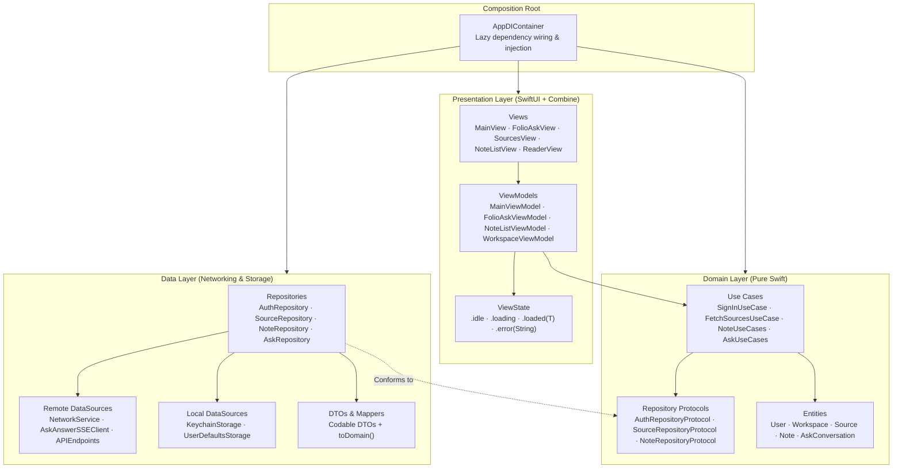
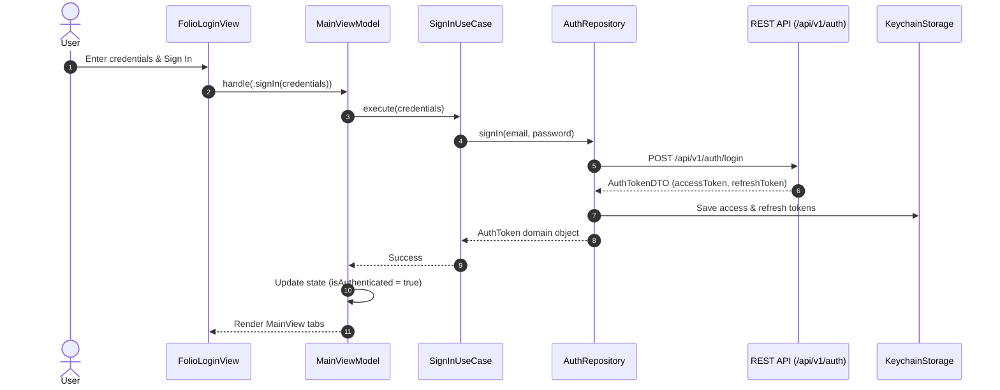
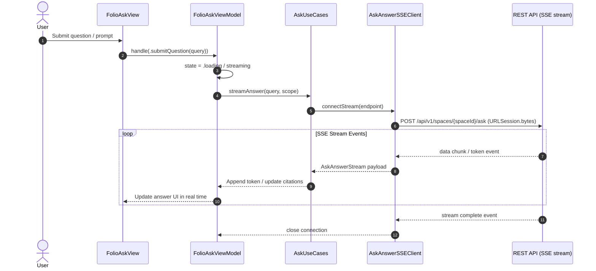
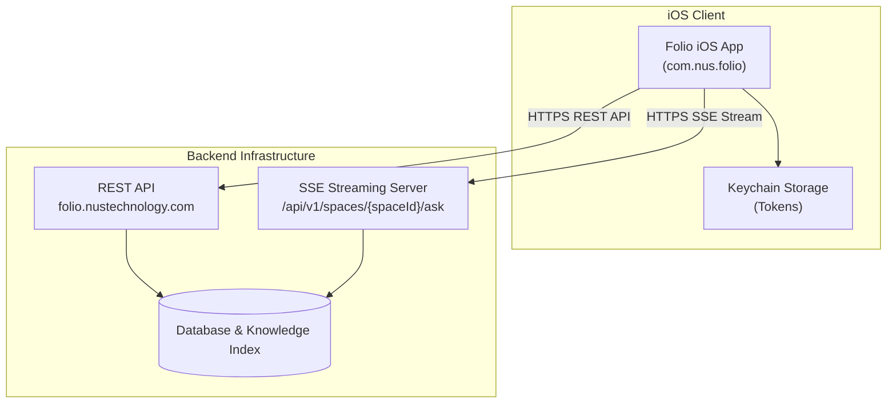
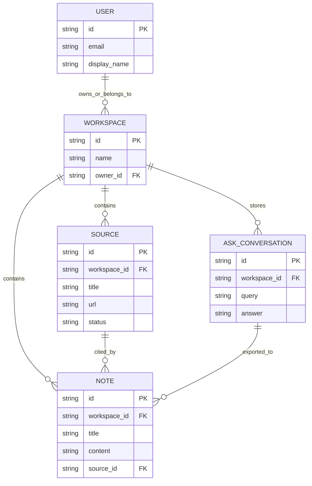

# Folio iOS

[](LICENSE)
[](Folio.xcodeproj)
[](https://swift.org)

**Folio** is a native iOS client developed by [NUS Technology](https://www.nustechnology.com/) for private research, grounded Q&A, and knowledge management. Sources, notes, and citations are organized in one unified, private archive.

This repository is the SwiftUI iOS client: users can authenticate, manage workspaces, import and read research sources, compose notes with rich-text formatting and citations, export research notebooks, and stream grounded AI answers using real-time SSE (Server-Sent Events).

- **Company:** [NUS Technology](https://www.nustechnology.com/)
- **Labs:** [Built by Our Engineers](https://www.nustechnology.com/labs)

## Table of contents

- [Tech stack](#tech-stack)
- [Getting started](#getting-started)
- [Project structure](#project-structure)
- [iOS architecture](#ios-architecture)
- [Sequence diagrams](#sequence-diagrams)
- [Deployment / runtime topology](#deployment--runtime-topology)
- [Conceptual data model](#conceptual-data-model)
- [Main screens & key features](#main-screens--key-features)
- [Rich text & citation engine](#rich-text--citation-engine)
- [Localization](#localization)
- [Testing](#testing)
- [Conventions](#conventions)
- [Detailed documentation](#detailed-documentation)
- [License](#license)

---

## Tech stack

| Layer | Technology |
|---|---|
| Language | Swift 5.0 (Swift Concurrency `async/await`, `@MainActor`) |
| UI | SwiftUI + Combine (`@Published`, `ObservableObject`) |
| Navigation | Tabbed `MainView` + NavigationStack + Sheets & Covers |
| Architecture | Clean Architecture + MVVM (`Presentation → Domain ← Data`) |
| Dependency Injection | Manual `AppDIContainer` (Composition Root) |
| Networking | `NetworkService` (`URLSession`) + `APIEndpoint` + Resilience retries |
| Streaming | `AskAnswerSSEClient` for Server-Sent Events (SSE) streaming answers |
| Auth | Bearer token auth via REST (`/api/v1/auth`); tokens in Keychain |
| Persistence | `UserDefaultsStorage` + `KeychainStorage` |
| Dependencies | Zero external third-party dependencies (Apple frameworks only; a `GoogleService-Info.plist` config is present for Firebase but no SDK is linked) |
| i18n | String Catalog (`Localizable.xcstrings` — English `en`, Vietnamese `vi`) |
| Testing | XCTest / Swift Testing (`FolioTests` — ViewModels, SSE, RichText, Network) |
| Code quality | SwiftLint (`.swiftlint.yml` — line length 120, 4-space indent, sorted imports) |

---

## Getting started

### Prerequisites

- Xcode **15.0+** (target **iOS 17.0+**)
- iOS Simulator or physical iOS device running iOS 17.0+
- Reachable REST API server at `https://folio.nustechnology.com`

### Run

```bash
open Folio.xcodeproj
```

1. Select the **Folio** scheme and an iOS Simulator or device.
2. Build and run (`⌘R`).

### Checks & Build

You can build and test the project via `xcodebuild`:

```bash
# Build Debug configuration
xcodebuild -project Folio.xcodeproj -scheme Folio -configuration Debug build

# Run unit tests suite
xcodebuild -project Folio.xcodeproj -scheme Folio -configuration Debug test
```

### API Configuration & Fail-Fast Validation

The API base URL is configured via environment `.xcconfig` files:

| Config | API Base URL | Display Name | Bundle ID |
|---|---|---|---|
| Debug | `https://folio.nustechnology.com` | Folio Dev | `com.nus.folio` |
| Release | `https://folio.nustechnology.com` | Folio | `com.nus.folio` |

- `Configuration/Shared.xcconfig` — deployment target
- `Configuration/Debug.xcconfig` & `Release.xcconfig` — `INFOPLIST_KEY_*` values read by `AppConfiguration`
- **Fail-fast behavior:** `AppConfiguration` validates that `API_BASE_URL` is an explicit HTTPS URL on startup; it fails fast if missing or invalid without falling back to embedded development endpoints.

---

## Project structure

```text
Folio/
├── FolioApp.swift              # @main entry point, creates AppDIContainer
├── App/
│   └── AppDIContainer.swift    # Composition root, lazy dependency wiring
├── Configuration/
│   └── AppConfiguration.swift  # Reads API_BASE_URL from Info.plist
├── Domain/
│   ├── Entities/               # Business models (structs)
│   ├── RepositoryProtocols/    # Repository abstractions (protocols)
│   └── UseCases/               # Business logic (protocol + final class)
├── Data/
│   ├── DataSources/
│   │   ├── Local/              # LocalStorageProtocol, UserDefaultsStorage, KeychainStorage
│   │   └── Remote/             # NetworkServiceProtocol, NetworkService, APIEndpoint, AskAnswerSSEClient
│   ├── DTOs/                   # Codable data transfer objects with toDomain()
│   └── Repositories/           # Repository implementations (conform to domain protocols)
├── Presentation/
│   ├── Common/
│   │   ├── Components/         # ErrorView, LoadingView, etc.
│   │   ├── Extensions/         # View+Extensions
│   │   ├── Protocols/          # ViewModelProtocol
│   │   └── ViewState.swift     # Generic ViewState<T> enum
│   └── Scenes/                 # Feature modules (Views + ViewModels per scene)
│       ├── Main/               # Auth, Tab shell, Q&A / Ask, Export, Account
│       ├── Sources/            # Spaces, source list, upload, status SSE
│       ├── Notes/              # Rich text notes, citations, convert to source
│       ├── Reader/             # Source HTML reader, web view, citations
│       └── Workspace/          # Workspace management & switching
├── Resources/                  # Localizable.xcstrings, Assets.xcassets
└── Utils/                      # Logger
```

Feature layer dependency flow: `Presentation → Domain ← Data` (Domain remains isolated at the center).

---

## iOS architecture

Code-layer view of the Folio iOS client based on **Clean Architecture + MVVM**:



| Layer | Dependency Rules | Description |
|---|---|---|
| **Presentation** | Depends on `Domain` | UI components and ViewModels conforming to `ViewModelProtocol`. Never imports `Data`. |
| **Domain** | Independent | Business logic, protocols, and domain entities. Has zero dependencies on outer layers. |
| **Data** | Depends on `Domain` | DTOs, network requests, local caching, and repository implementations. |
| **AppDIContainer** | Assembles all layers | Lazy dependency wiring instantiated once at `FolioApp` entry point. |

---

## Sequence diagrams

### 1. Authentication flow



### 2. Grounded Q&A streaming flow (Ask / SSE)



---

## Deployment / runtime topology



| Communication Channel | Protocol | Usage |
|---|---|---|
| **Control Plane** | HTTPS JSON REST API | Auth, workspace management, sources, notes |
| **Grounded Q&A** | HTTPS Server-Sent Events (SSE) | Real-time streaming answers with live citations |
| **Secure Token Storage** | On-Device iOS Keychain | Access token & Refresh token persistence |

---

## Conceptual data model



| Entity | Description |
|---|---|
| **USER** | Authenticated user entity |
| **WORKSPACE** | Isolated research archive owning sources, notes, and Q&A conversations |
| **SOURCE** | Research document or web source ingested for grounded Q&A |
| **NOTE** | Rich-text research note containing source citations |
| **ASK_CONVERSATION** | Grounded Q&A conversation thread with citation references |

---

## Main screens & key features

| Screen / Feature | Description |
|---|---|
| **Login / Sign Up** | Sign in with email or register an account (password reset UI present; backend pending) |
| **Sources (Spaces)** | Ingest web links and documents, track background parsing status via SSE |
| **Source Reader** | Built-in HTML reader and web view with citation preview sheets |
| **Notes & Citations** | Create and organize rich-text notes with source citations and back-links |
| **Convert Note to Source** | Convert user draft notes directly into ingested research sources |
| **Folio Ask (Q&A)** | Real-time SSE streaming Q&A grounded on workspace sources |
| **Notebook Export** | Export research notes and Q&A conversations to Markdown / text files |
| **Workspace Selector** | Multi-workspace management and seamless switching |
| **Account Settings** | Manage user profile and application settings |

---

## Rich text & citation engine

Folio features a custom rich-text and citation engine built using pure Swift and SwiftUI:

- **Markdown Round-Trip Support:** Parsers and formatters handle headings, blockquotes, bullet/numbered lists, and inline styles (bold, italic, code).
- **Citation Badges & Preview Sheets:** Tapping a citation in an answer or note opens `CitationDetailSheet`, displaying exact quoted passages and source metadata.
- **Save Q&A as Note:** Convert grounded Q&A streams directly into saved rich-text notes (`SaveAskNoteSheet`).

---

## Localization

Supported languages in String Catalog (`Folio/Resources/Localizable.xcstrings`):
- English (`en`) — primary
- Vietnamese (`vi`)

All user-facing strings are stored in `Localizable.xcstrings`. When adding new strings, append them to the catalog to avoid merge conflicts.

---

## Testing

The test suite in `FolioTests/` covers ViewModels, networking resilience, SSE stream parsing, and rich-text round-trip formatting:

```bash
# Execute unit test suite
xcodebuild -project Folio.xcodeproj -scheme Folio -configuration Debug test
```

---

## Conventions

- Follow rules defined in `CLAUDE.md` and `AGENTS.md`.
- Strict Clean Architecture dependency flow: `Presentation → Domain ← Data`.
- All ViewModels conform to `ViewModelProtocol` (`State`, `Action`, `handle(_:)`).
- UI state updates take place on `@MainActor`.
- Zero external third-party dependencies (Apple frameworks only).

---

## Detailed documentation

| Document | Purpose |
|---|---|
| [CLAUDE.md](CLAUDE.md) | Architecture, coding guidelines, conventions, and project commands |
| [AGENTS.md](AGENTS.md) | Compatibility entry point for AI development assistants |

---

## License

This project is licensed under the [NUS Technology Non-Commercial License 1.0](LICENSE). Commercial use and redistribution are not permitted. The bundled Cormorant Garamond font files are licensed separately under the [SIL Open Font License 1.1](Folio/Resources/Fonts/OFL.txt). For commercial licensing, contact [NUS Technology](https://www.nustechnology.com/).
